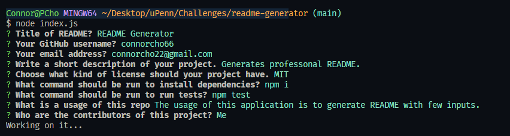
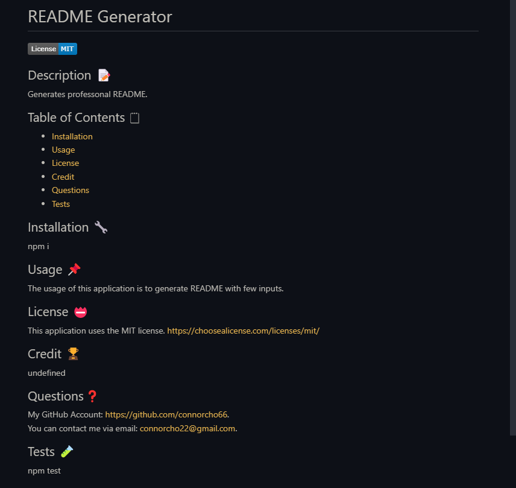

# readme-generator

## Description

A project where Node.js is based too let users generate README.md quick and easy by using command-line. By doing so, users can spend more time to improve project.

## Demo
Link to Demo Video: <a href="https://drive.google.com/file/d/1fmWDcyDN999jutmABmdX5xS5HCI-eN0t/view"> Link to google drive video</a>

## Screenshot
Below is picture of generating README.md using a terminal.

Below is picture of generated README.md through the terminal.

## Tech Used

## Installation
In order to utilize this application, user have to install node.js,
and in addition to node.js, need to install inquirer.js. It's done when user types "node i inquirer" into the terminal.

## License

N/A

## Contact

<ul>
    <li><b>Email: </b> <a href="connorcho22@gmail.com">connorcho22@gmail.com</a></li>
    <li><b>Github: </b> <a href="https://github.com/connorcho66">connorcho66</a></li>
    <li><b>Linked In: </b> <a href="www.linkedin.com/in/seongyun-cho-89a8a61a0">SeongYun Cho</a></li>
</ul>